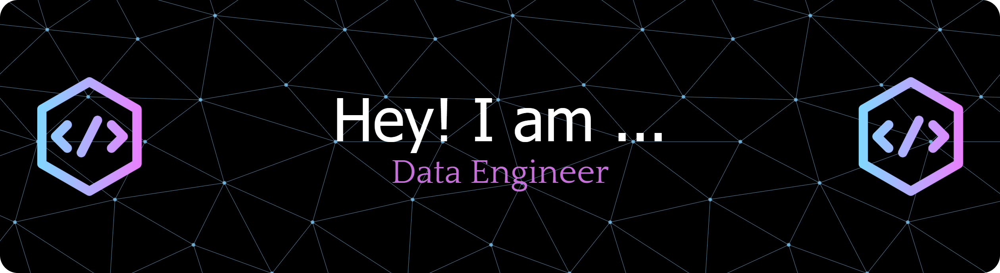

<h1 align="center">Hi 👋, I'm SRIDHAR V</h1>
<h3 align="center">Data Engineer | AI & ML Enthusiast | Full Stack Developer</h3>

  

- 🌱 Currently working on **AI-powered Data Engineering solutions**  
- 💼 Data Engineer at **Cognizant Technology Solutions**  
- 💬 Ask me about **PySpark, SQL, Python, Azure, Databricks, LangChain, Django, Agentic AI**  
- 👨‍💻 All my projects are available at [GitHub](https://github.com/Sridhar1508/)  
- 📫 Reach me at **sridharmasthan@gmail.com**  
- ⚡ Fun fact: **I blend coffee ☕ with code equally well!**

---

### 🚀 What I’m Working On
- 🔹 **AI-based ETL Optimizer** using GenAI & Databricks  
- 🔹 **Resume-based RAG Model** using LangChain & Vector Databases  
- 🔹 **SQL → PySpark Migration Automation** for performance optimization  

---

### 🌐 Connect with Me

---

### 🛠️ Languages and Tools

<!-- Data Engineering -->

<!-- Web Development -->

---

### 📊 GitHub Stats

&nbsp;

